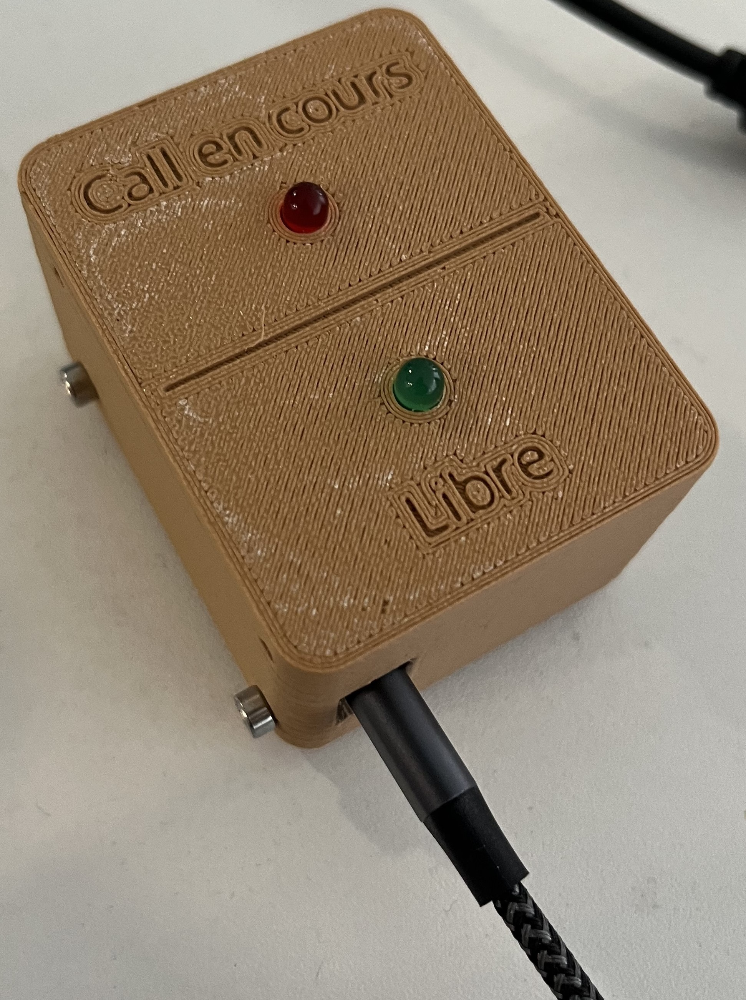
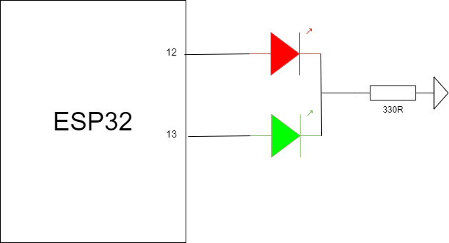
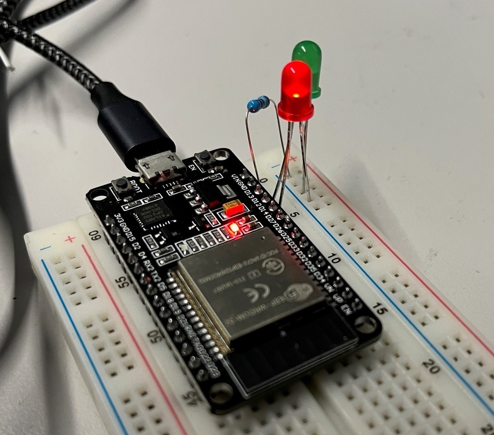

# Video-Call-Warner-MQTT
 
This project make it possible to tell your coworkers if they can enter your office and make noise or if you are in a video call or phone and you must be left alone.


You can select on a webpage if the office is free or not and it lights up the corresponding light next to your door.



## Getting started

### Prerequisite

Here's what I used for this project :

|   BOM   |
|:---------:|
| Raspberry Pi 3B+|
| ESP32 Dev Board|
| Micro USB power supply
| Red LED |
| Green LED |
| 330Ω resistor|

### Install the MQTT Broker

Install Mosquitto on the Raspberry Pi
```
sudo apt-get update
sudo apt-get install mosquitto
```

Configure the broker, add these lines in the configuration file. This will enable user, port 1883 and websockets port 8081
```
sudo nano /etc/mosquitto/mosquitto.conf


password_file /etc/mosquitto/passwd
listener 1883
listener 8081
protocol websockets
```

Add at least one user to your broker. Choose a username in the command, it will then ask you for a password for this user
```
mosquitto_passwd -c passwd USERNAME
```
Restart the service
```
sudo systemctl restart mosquitto
```

## Install webserver

Although you can just load the file index.html in your browser in local it's easier to store it on a webserver. I used lighttpd as it is very lightweight and easy to use.

```
sudo apt-get update
sudo apt-get install lighttpd
```

#### Download and configure the necessary files
[Download or clone this repo](https://geektechstuff.com/2019/09/09/introduction-to-github-raspberry-pi/) anywhere you want. Go in the downloaded directory.

Place the index.html file inside the webpage folder of lighttpd (/var/www/html by default)
```
sudo mv Webserver/index.html /var/www/html/
```
Open the index.html file and edit the connection credentials with the ones you created before.
```
var client = mqtt.connect('ws://IP_ADDRESS:8081', { // update this
    clientId: randomClientId,
    username: 'USERNAME', // update this
    password: 'PASSWORD', // update this
});
```

You can find the IP address of the Raspberry Pi using :

```
hostname -I
```

You can then go to the IP address of your Raspberry Pi in your browser and the webpage should load correctly.

## Upload the code to the ESP32

The code provided is meant to be open in the [Arduino IDE](https://www.arduino.cc/en/software).
- Install the Adafruit_MQTT library
- Select ESP32 Dev Module
- Select the correct COM port
- Update the Wifi and MQTT credentials where it is needed
```
// Wifi informations
const char* ssid = "SSID"; // update this
const char* password = "WIFI_PASSWORD"; // update this

// MQTT Broker informations
#define MQTT_SERVER "BROKER_ADRESS" // update this
#define MQTT_PORT 1883 
#define MQTT_USERNAME "USERNAME" // update this
#define MQTT_PASSWORD "PASSWORD" // update this
```
- Flash the code inside the ESP32

You can check the logs on the console inside the IDE.

## Wiring

Connect a red LED to D12 on the ESP32 and a green LED to D13. Add a current limiting resistor of 330 ohms after them. You can use only one resistor if you light up only one LED at a time.





## 3D Printing Box

You can find the 3D STL files if you want to 3D print this box. It uses M3 screws, M3 tap and 5mm LEDs.