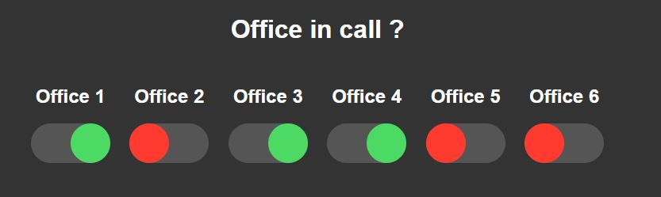

# Video-Call-Warner-MQTT
 
This project make it possible to tell your coworkers if they can enter your office and make noise or if you are in a video call or phone and you must be left alone.



You can select on a webpage if the office is free or not and it lights up the corresponding light next to your door.

## Getting started

### Prerequisite

Here's what I used for this project :

|   BOM   |
|:---------:|
| Raspberry Pi 3B+|
| ESP32 Dev Board|
| Micro USB power supply
| Red LED |
| Green LED |
| 330Ω resistor|

### Install the MQTT Broker

Install Mosquitto on the Raspberry Pi
```
sudo apt-get update
sudo apt-get install mosquitto
```

Configure the broker, add these lines in the configuration file. This will enable user, port 1883 and websockets port 8081
```
sudo nano /etc/mosquitto/mosquitto.conf


password_file /etc/mosquitto/passwd
listener 1883
listener 8081
protocol websockets
```

Add at least one user to your broker. Choose a username in the command, it will then ask you for a password for this user
```
mosquitto_passwd -c passwd USERNAME
```
Restart the service
```
sudo systemctl restart mosquitto
```

## Install webserver

Although you can just load the file index.html in your browser in local it's easier to store it on a webserver. I used lighttpd as it is very lightweight and easy to use.

```
sudo apt-get update
sudo apt-get install lighttpd
```

#### Download the necessary files
[Download or clone this repo](https://geektechstuff.com/2019/09/09/introduction-to-github-raspberry-pi/) anywhere you want. Go in the downloaded directory.

Place the index.html file inside the webpage folder of lighttpd (/var/www/html by default)
```
sudo mv Webserver/index.html /var/www/html/
```

You can go to the IP address of your Raspberry Pi in your browser and the webpage should load correctly